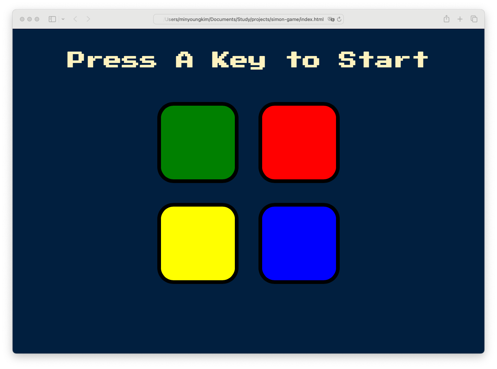

# Simon Game 🎮
This is an interactive Simon game built with JavaScript, jQuery, HTML, and CSS.

## 🚀 Features
- Responsive design
- Sound effects
- Randomized sequence generation

## 🎥 Demo Video
📌 **Click the screenshot below to watch the demo:**

## 🛠 Technologies Used
- JavaScript
- jQuery
- HTML & CSS

## 📂 How to Run
1. Clone the repo:  
      git clone https://github.com/minyoungkim525-dev/simon-game.git
2. Open "index.html" in your browser.
